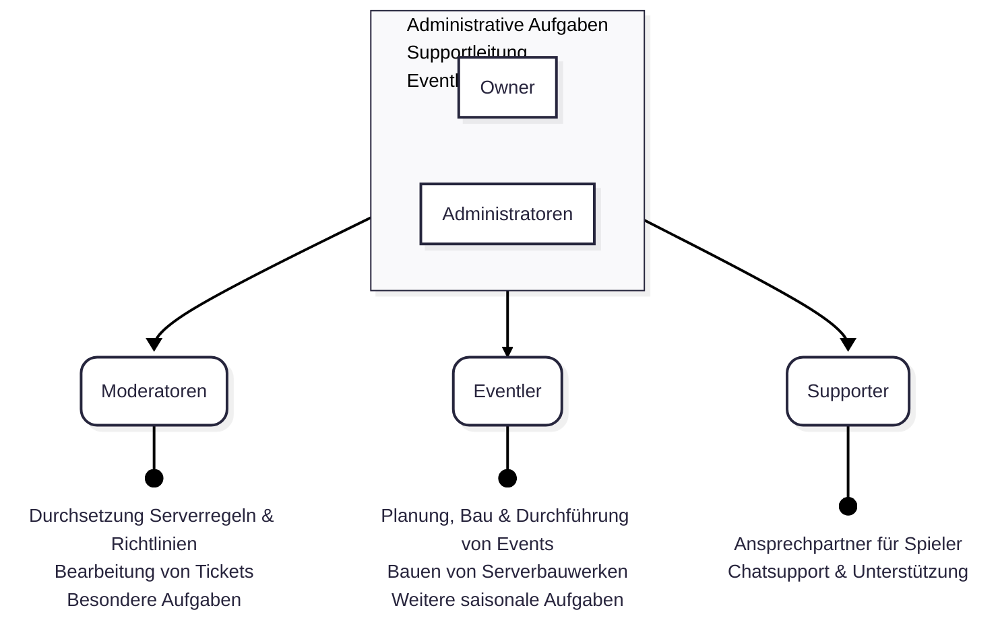

# Serverteam
Das Serverteam ist dafür zuständig, dass alle Aspekte des Servers, sowohl von technischer als auch spielinterner Seite, reibungslos funktionieren. Dazu gehört unter anderem, dass die Serverregeln eingehalten werden, neue und spannende Änderungen für das Spielerlebnis eingeführt werden und die Funktionalität aller Plugins sowie spielbeeinflussenden Serverelemente gewährleistet ist.

---

## Liste der Teamler
Im folgenden findest du alle aktiven Teammitglieder und ihre Aufgabenbereiche.

### Owner
||| kev2k2 [!badge variant="info" text="seit 2019"]
-
**Aufgaben:**

Serverleitung\
Backend
||| flowflower [!badge variant="secondary" text="seit 2019"]
-
**Aufgaben:**

 Serverleitung\
 Eventverwaltung\
 Bauevent-Organisation
|||

### Admins
||| LPBoy_HD
-
**Aufgaben:**

 Interne Organisation\
 Backend\
 Entwicklung
||| LashtagLP
-
**Aufgaben:**

 Interne Organisation\
 Event-Organisation\
 Claimvergabe
||| Filomez
-
**Aufgaben:**

 Supportleitung\
 Spielerfeedback
 Bauevent-Organisation
|||

### Moderatoren
||| Cupcake7506
-
**Aufgaben:**

 Spielersupport\
 Wiki
||| Blechgecco
-
**Aufgaben:**

 Spielersupport\
 Farmen
||| Adrxxian
-
**Aufgaben:**

 Spielersupport
|||

### Eventler
||| Useflo
-
**Aufgaben:**

 Event-Entwicklung\
 Erbauen von Maps
||| Polarfoxine
-
**Aufgaben:**

 Event-Entwicklung\
 Erbauen von Maps
||| Krempii
-
**Aufgaben:**

 Event-Entwicklung\
 Erbauen von Maps
|||

Die Teammitglieder sind in vier Ränge unterteilt. Eventler kümmern sich um die Konzeption und Durchführung von Events sowie um den Mapbau. Die Moderatoren sind in erster Linie für das direkte Spielerlebnis auf dem Server verantwortlich. Sie sorgen dafür, dass die Regeln des Servers eingehalten werden, und helfen bei jeglichen Problemen. Die Admins und Owner bilden die Spitze des Serverteams. Sie sind eine Schnittstelle zwischen dem Frontend (dem Server selbst) und dem Backend (Plugins, Webseiten etc.). Das bedeutet konkret, dass sie teilweise auch Aufgaben eines Moderators übernehmen, jedoch auch für andere Aspekte des Spielerlebnisses verantwortlich sind, wie etwa die Verwaltung der Plugins.

---

## Teamstruktur im Detail

### Owner
Die Owner leiten den Server und sind für die technische Bereitstellung des Servers und die Finanzen verantwortlich. Ein Großteil der Arbeit, insbesondere im Zusammenhang mit dem Backend und den Plugins, findet im Hintergrund statt. Ebenso werden je nach Situation Entscheidungen im Serverteam durch die Owner final abgesegnet. Owner sind zudem je nach Bedarf auch für andere Aufgaben aus dem Administratoren-Bereich zuständig.

### Administratoren
Die Admins besitzen mehrere Aufgaben, welche umfassende Rechte erfordern. So spielt zum einen die Pluginentwicklung und Entwicklung von neuen Funktionen eine Rolle. Eine weitere Aufgabe ist die Supportleitung als Ansprechpartner für die Moderatoren und Koordination von Support und Einhaltung der Serverregeln. Ebenso findet im Rahmen der Eventleitung zusätzlich zur Kommunikation mit den Eventlern eine technische Einrichtung und ggf. Durchführung spezieller Events statt.

### Moderatoren
Die Moderatoren tragen die Verantwortung für die Einhaltung und Durchsetzung der Serverregeln und Richtlinien. Darüber hinaus kümmern sie sich um die Bearbeitung der Tickets auf Discord. Auch spezielle Aufgaben, wie zum Beispiel die Bearbeitung von Farmanmeldungen, werden von den Moderatoren übernommen. Je nach Verfügbarkeit bzw. wenn keine Supporter online sind, können sie zudem Fragen von Spielern im Chat beantworten.

### Eventler
Die Eventler bauen nicht nur die Maps für unsere Events, sondern führen diese auch durch. Dazu gehört auch die Konzeption und Planung der Events. Ebenso werden sonstige servereigene Bauwerke (z.B. Spawn) überwiegend von den Eventlern erbaut. Darüber hinaus melden die Eventler Unregelmäßigkeiten an die Moderatoren bzw. die Supportleitung und können notfalls beschränkt Bestrafungen einleiten. Eventler sind jedoch nicht verpflichtet, den Spielersupport zu übernehmen. Falls kein Moderator anwesend ist, sollte ein Ticket erstellt werden, damit wir uns zentral um das Anliegen kümmern können.

### Supporter
Die Supporter sind für den Chatsupport zuständig. Sie stehen als erste Ansprechpartner für die Spieler zur Verfügung und kennen sich gut mit den Funktionen auf OpenMC aus. Ebenso unterstützen sie bei Bedarf neue Spieler beim Start auf dem Server. Genau wie die Eventler melden sie Unregelmäßigkeiten an die Moderatoren bzw. die Supportleitung und können notfalls beschränkt Bestrafungen einleiten.
---

## Teambesprechungen
Teambesprechungen dienen dem regelmäßigen Austausch im Team, um Fortschritte zu teilen und die zukünftige Entwicklung von OpenMC zu planen. Diese erfolgen je nach Verfügbarkeit ein- bis zweimal im Monat.

Während der Besprechungen durchlaufen wir eine grobe Struktur an Themen: Zu Beginn werden Routine-Aufgaben besprochen, um ins Gespräch zu kommen. Dazu gehören Themen wie die Verwaltung der Siedler, Claimvergaben und der Austausch darüber, wer was gemacht hat oder wo Hilfe benötigt wird. Zuerst werden die priorisierten Themen behandelt, damit dafür ausreichend Zeit zur Verfügung steht und ausführliche Lösungen oder Ideen erarbeitet werden können. Danach folgen die sonstigen Themen, die sich bis zur Teambesprechung angesammelt haben. Abschließend besprechen wir in großer Runde die Forumsvorschläge, um diese auf Umsetzbarkeit, Konsistenz und Akzeptanz hin zu überprüfen.

Nachdem die wichtigsten Punkte besprochen wurden, werden die Themen zwischen Mod-Themen und Event-Themen aufgeteilt, wodurch zwei separate, kleinere Besprechungen entstehen. In diesen werden Themen besprochen, die unter die jeweiligen Verantwortungsbereiche fallen.

Eine volle Teambesprechung dauert in der Regel zwischen zwei und vier Stunden. Während dieses Zeitraums werden die Ergebnisse intern protokolliert, um unsere Aufgabenplanung auf dem Server entsprechend zu aktualisieren. Wichtige Neuerungen werden nach ihrer Umsetzung in den News bekannt gegeben.

---

## Spielertreffen
Je nach zeitlicher Verfügbarkeit werden Spielertreffen in einem zweimonatigen Zyklus organisiert. Diese Treffen bieten die Gelegenheit, mit euch über anstehende Neuerungen und Themen rund um OpenMC zu sprechen und Raum für einen aktiven Meinungsaustausch zu schaffen. Eingebrachtes Feedback wird in einer weiteren Teambesprechung evaluiert und bei Übereinstimmung umgesetzt. Weitere Informationen zu den Spielertreffen sind jeweils in den News auf Discord zu finden.

INITIATIV