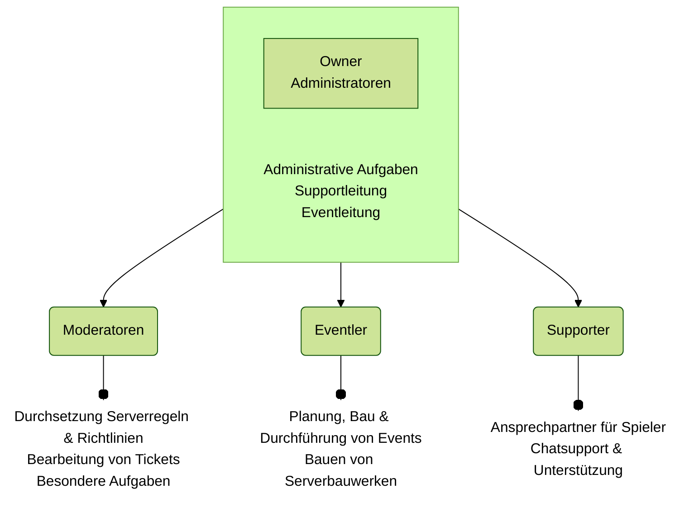

# Serverteam
Das Serverteam ist dafür zuständig, dass alle Aspekte des Servers, sowohl von technischer als auch konzeptioneller Seite, reibungslos funktionieren. Dazu gehört unter anderem, dass die Serverregeln eingehalten werden, neue und spannende Änderungen für das Spielerlebnis eingeführt werden und die Funktionalität aller Plugins sowie spielbeeinflussenden Serverelemente gewährleistet ist.

---

## Liste der Teamler
Im folgenden findest du alle aktiven Teammitglieder und ihre Aufgabenbereiche.

### Owner
||| kev2k2 [!badge variant="success" text="seit 2019 im Team"]
-
**Aufgaben:**

Serverleitung\
Backend\
Eventeinrichtung
||| flowflower [!badge variant="success" text="seit 2019 im Team"]
-
**Aufgaben:**

 Serverleitung\
 Eventverwaltung\
 Bauevent-Organisation
|||

### Administratoren
||| LPBoy_HD [!badge variant="success" text="seit 2020 im Team"]
-
**Aufgaben:**

 Interne Organisation\
 Backend\
 Entwicklung
|||

### Moderatoren
||| Cupcake7506 [!badge variant="success" text="seit 2021 im Team"]
-
**Aufgaben:**

 Moderation\
 Spieler-support\
 Wiki
||| Blechgecco [!badge variant="success" text="seit 2023 im Team"]
-
**Aufgaben:**

 Moderation\
 Spieler-support\
 Farmen
||| Adrxxian [!badge variant="success" text="seit 2025 im Team"]
-
**Aufgaben:**

 Moderation\
 Spieler-support\
 Claim-vergabe
||| Aleischa [!badge variant="success" text="seit 2025 im Team"]
-
**Aufgaben:**

 Moderation\
 Spieler-support
|||

### Eventler
||| Useflo [!badge variant="success" text="seit 2024 im Team"]
-
**Aufgaben:**

 Event-Entwicklung\
 Erbauen von Maps
||| Polarfoxine [!badge variant="success" text="seit 2024 im Team"]
-
**Aufgaben:**

 Event-Entwicklung\
 Erbauen von Maps
||| Krempii [!badge variant="success" text="seit 2024 im Team"]
-
**Aufgaben:**

 Event-Entwicklung\
 Erbauen von Maps\
 Instagram-Account
|||

### Supporter
||| Thunder492 [!badge variant="success" text="seit 2025 im Team"]
-
**Aufgaben:**

 Spielersupport
||| Brausefisch [!badge variant="success" text="seit 2026 im Team"]
-
**Aufgaben:**

 Spielersupport
||| DoctorSetzling [!badge variant="success" text="seit 2026 im Team"]
-
**Aufgaben:**

 Spielersupport
|||

---

## Die Teamstruktur
In der folgenden Übersicht ist der Aufbau des Teams schematisch dargestellt. Im Anschluss werden die jeweiligen Aufgaben der Ränge beschrieben.

### Owner
Die Owner leiten den Server und sind für die technische Bereitstellung des Servers und die Finanzen verantwortlich. Ein Großteil der Arbeit, insbesondere im Zusammenhang mit dem Backend und den Plugins, findet im Hintergrund statt. Ebenso werden je nach Situation Entscheidungen im Serverteam durch die Owner final abgesegnet. Owner sind zudem je nach Bedarf auch für andere Aufgaben aus dem Administratoren-Bereich zuständig.

### Administratoren
Die Admins besitzen mehrere Aufgaben, welche umfassende Rechte erfordern. So spielt zum einen die Pluginentwicklung und Entwicklung von neuen Funktionen eine Rolle. Eine weitere Aufgabe ist die Supportleitung als Ansprechpartner für die Moderatoren und Koordination von Support und Einhaltung der Serverregeln. Ebenso findet im Rahmen der Eventleitung zusätzlich zur Kommunikation mit den Eventlern eine technische Einrichtung und ggf. Durchführung spezieller Events statt.

### Moderatoren
Die Moderatoren tragen die Verantwortung für die Einhaltung und Durchsetzung der Serverregeln und Richtlinien. Darüber hinaus kümmern sie sich um die Bearbeitung der Tickets auf Discord. Auch spezielle Aufgaben, wie zum Beispiel die Bearbeitung von Farmanmeldungen, werden von den Moderatoren übernommen. Je nach Verfügbarkeit bzw. wenn keine Supporter online sind, können sie zudem Fragen von Spielern im Chat beantworten.

### Eventler
Die Eventler bauen nicht nur die Maps für unsere Events, sondern führen diese auch durch. Dazu gehört auch die Konzeption und Planung der Events. Ebenso werden sonstige servereigene Bauwerke (z.B. Spawn) überwiegend von den Eventlern erbaut. Darüber hinaus melden die Eventler Unregelmäßigkeiten an die Moderatoren bzw. die Supportleitung und können notfalls beschränkt Bestrafungen einleiten. Eventler sind jedoch nicht verpflichtet, den Spielersupport zu übernehmen. Falls kein Moderator anwesend ist, sollte ein Ticket erstellt werden, damit wir uns zentral um das Anliegen kümmern können.

### Supporter
Die Supporter sind für den Chatsupport zuständig. Sie stehen als erste Ansprechpartner für die Spieler zur Verfügung und kennen sich gut mit den Funktionen auf OpenMC aus. Ebenso unterstützen sie bei Bedarf neue Spieler beim Start auf dem Server. Genau wie die Eventler melden sie Unregelmäßigkeiten an die Moderatoren bzw. die Supportleitung und können notfalls beschränkt Bestrafungen einleiten.

---

## Teambesprechungen
Teambesprechungen dienen dem regelmäßigen Austausch im Team, um Fortschritte zu teilen und die zukünftige Entwicklung von OpenMC zu planen. Diese erfolgen je nach Verfügbarkeit ein- bis zweimal im Monat.

Während der Besprechungen werden eine Vielzahl an Themen behandelt. Es wird sowohl über die Routine-Aufgaben wie die Verwaltung der Siedler oder Claimvergaben gesprochen, als auch über größere konzeptionelle Themen und die eingrereichten Forumsvorschläge. Letztere werden auf Umsetzbarkeit, Konsistenz und Akzeptanz hin geprüft. 

Nachdem die wichtigsten Punkte besprochen wurden, werden die Themen zwischen Mod-Themen und Event-Themen aufgeteilt, wodurch zwei separate, kleinere Besprechungen entstehen. In diesen werden Themen besprochen, die unter die jeweiligen Verantwortungsbereiche fallen.

Eine volle Teambesprechung dauert in der Regel zwischen zwei und drei Stunden. Während dieses Zeitraums werden die Ergebnisse intern protokolliert, um unsere Aufgabenplanung auf dem Server entsprechend zu aktualisieren. Wichtige Neuerungen werden nach ihrer Umsetzung in den News bekannt gegeben.

---

## Spielertreffen
Je nach zeitlicher Verfügbarkeit werden Spielertreffen in einem ein- bis zweimal pro Jahr organisiert. Diese Treffen bieten die Gelegenheit, mit euch über anstehende Neuerungen und Themen rund um OpenMC zu sprechen und Raum für einen aktiven Meinungsaustausch zu schaffen. Eingebrachtes Feedback wird in einer weiteren Teambesprechung evaluiert und bei Übereinstimmung umgesetzt. Weitere Informationen zu den Spielertreffen sind jeweils in den News auf Discord zu finden.

---

## Bewerben
Eine Aufnahme ins Team kann sowohl durch die Teilnahme an einer Bewerbungsphase als auch durch eine Intitiativbewerbung erfolgen. Je nach Rang setzen wir unterschiedliche Kenntnisse und eine gewisse Spielzeit auf OpenMC voraus. Wir sind gespannt auf deine Bewerbung!

---

## Ehemalige
Über die Jahre haben viele tolle Menschen am Server mitgewirkt. Du kannst die ehemaligen Teammitglieder unter dem Spawn besuchen (Eingang im kleinen Spawnhäuschen).

-